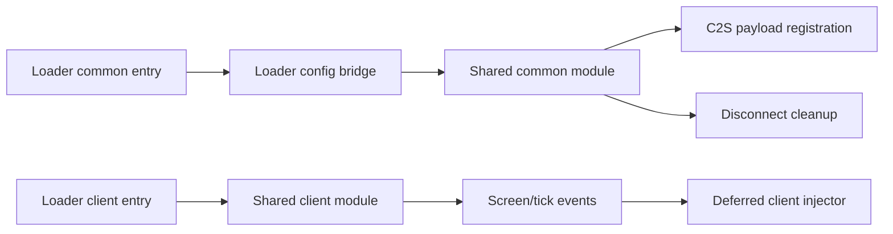

# 项目架构

本文固定 Waystones Player 的模块、信任、兼容和多目标维护边界。领域词汇以 [CONTEXT.md](../CONTEXT.md) 为准，真实依赖矩阵以 [gradle/targets.json](../gradle/targets.json) 为准。

## 仓库与分支

`发行版` 是唯一正式 Git 仓库。五个长期分支的含义不可互换：

| 分支 | 固定职责 | 正式目标 |
|---|---|---:|
| `main` | NeoForge 1.21.1 原设计、默认分支、共享行为语义源 | 1 |
| `neoforge/1.21.x` | NeoForge 1.21.2–1.21.11 统一维护线 | 9 |
| `fabric/1.21.x` | Fabric 1.21.1–1.21.11 统一维护线 | 10 |
| `neoforge/26.x` | NeoForge 26.1–26.2、Java 25、Shogi 事务维护线 | 4 |
| `fabric/26.x` | Fabric 26.1–26.2、Java 25、Shogi 事务维护线 | 4 |

每个加载器的 Minecraft 1.21.2/1.21.3 共用一个经两版运行验收的产物，其余目标各自精确限制一个 Minecraft 小版本。Forge 不在范围内。所有产物继续使用 `1.0.0`，只有用户明确批准后才能变更。

统一分支不是把多套不兼容源码塞进一个 source set。它们使用显式目标工程，每个工程有独立 Minecraft、映射、Loader、Waystones、Balm、元数据、运行目录和发行 JAR；共享只发生在已经证明签名一致的源码族。

## 模块模型

```text
waystonesplayer
├── core                 纯 Java 规则、值对象、布局/差分算法和单元测试
├── common               Minecraft-bound 业务、协议、兼容、Mixin、客户端控件和资源
├── loader target        入口、配置、加载器网络桥接、元数据与发行打包
└── gradle/targets.json  28 个正式产物的机器可读依赖/适配矩阵
```

### core

- 禁止链接 Minecraft、Fabric、NeoForge、Waystones、Balm 或 Mixin。
- 保存跨版本真正稳定的业务规则，例如费用模式、请求限流、响应式几何、玩家目录差分和到达判定。
- `verifyCorePurity` 在每次 `check` 扫描边界；各发行 JAR显式合并 core 输出。

### common

- 按每个目标的 Minecraft/Waystones/Balm 重新编译，不作为跨 Minecraft 版本复用的已编译 JAR。
- 保存网络契约、服务端授权与结算、Waystones 兼容边界、客户端玩家目录、语言、原图标和 Mixin。
- 禁止导入 `net.fabricmc.*` 或 `net.neoforged.*`；`verifyCommonLoaderBoundary` 自动拒绝越界。
- 可以按已确认的 API 断点选择少量 source family，但不能复制业务语义。

### loader target

- 只负责物理端入口、加载器配置、网络注册、加载器元数据、运行配置和最终打包。
- NeoForge 保留 SERVER 配置的全局默认、按世界覆盖与重载语义。
- Fabric 保持同名 `waystonesplayer-server.toml`、同键、同默认值和重启读取，但只提供实例全局配置。
- 客户端入口必须与通用/服务端入口分离；物理服务器不得链接 Minecraft 客户端、Waystones GUI 或客户端 Mixin 类。

## 初始化与物理端边界



共享客户端入口仅按屏幕类名进行轻量筛选，再反射延迟加载 Minecraft/Waystones GUI 绑定类；这是物理服务端类加载隔离，不是用反射掩盖任意兼容问题。布局结构、菜单和传送内部访问只允许集中在 `compat`、`mixin` 和客户端注入边界。

## 网络与服务端信任

[waystonesplayer.network.json](../common/src/main/resources/waystonesplayer.network.json) 是协议的机器契约：

- 网络版本 `1`。
- 唯一载荷 `waystonesplayer:request_player_teleport`。
- 方向固定 client → server。
- 载荷只包含目标 UUID。
- Balm/加载器桥接必须把处理放回服务器主线程。

服务端从不接受客户端提交的坐标、费用、物品、手、可见性或成功状态。每次请求重新查询服务器状态；每名发送者有 10 tick 限流，退出时清理。

任何协议变更都必须同时更新 payload 编解码、方向、主线程保证、服务端验证、网络契约资源、所有目标构建和兼容策略。

## Warp Stone 使用绑定

上游菜单保存 Warp Stone 的方式在 1.21.x 中不稳定；`getWarpItem()` 既不是所有版本都有，也不足以证明对象仍在玩家手中。统一语义采用菜单实例载体：

1. Waystones 的 `WarpStoneItem.finishUsingItem` 返回且菜单已经打开后，服务端 Mixin读取该次调用的真实 `ItemStack`。
2. 只通过对象身份在当前主手/副手解析使用手。
3. 当前 `WaystoneSelectionMenu` Mixin保存该栈引用和手，不使用全局映射。
4. 请求处理时核对菜单注册表 ID、载体存在、栈仍是 Warp Stone，并且玩家该手中的对象仍为同一实例。

菜单不匹配、物品被换走、Mixin 失效或上游结构变化都会拒绝请求且不收费。兼容错误只记录一次，避免日志洪泛。

## 玩家目的地与结算

服务端顺序是安全语义的一部分：

1. 限流。
2. 验证菜单及 Warp Stone 使用绑定。
3. 重新解析目标，要求在线、不是发送者并且 `allowsListing()` 为真。
4. 以目标当时的维度、方块位置和名称创建 transient、未注册的玩家 Waystone。
5. 创建 unbound Waystones context，启用声音/效果、关闭 Waystone 方块 modifiers，并附加玩家目的地标记。
6. 按配置只筛选 Waystones 自带的经验点数/等级 requirement；解析形状、参数、中间运算和最终 requirement 树都必须可验证、有限、非负且不溢出。创造模式明确使用空 requirement。
7. 锁定费用并在任何消费前捕获发送者的精确经验进度、等级和总经验。Before/Pre 事件仍可观察、取消或重定向目标；任何 `setRequirements` 替换企图都会使整次传送失败。
8. 在事件重定向完成后的 `canAfford`/`consume` 最终边界重新验证玩家、手、物品对象/组件，以及目标四个水平相邻位置中至少一个身体格和头部格均不窒息的候选；创造模式也不能跳过该边界。
9. 调用当前版本适配的 Waystones 同步传送管线，同时要求 API 报告发送者，并确认发送者到达目标区域或被事件重定向后确实移动；取消、假成功或未移动都恢复经验。
10. 确认成功后才重置坠落距离，并重新读取原手当前栈：优先同一引用，其次接受同物品同组件替换，或在背包中定位被移动的原引用，再执行一次 `hurtAndBreak(1, ...)`。若第三方已彻底移除物品，不损坏无关栈、不回滚已完成移动，记录兼容性错误并关闭菜单。

如果上游在已经移动发送者后抛出运行时/链接异常，实际移动优先作为确认成功，避免把已完成传送错误地回滚费用而造成免费传送。`consume` 会记录事件后通过检查的目标；移动后再核对实际维度、目标/水平相邻方块和身体/头部非窒息状态。无法匹配时不退费，仍按实际移动结算耐久、关闭界面并报告兼容性警告。未移动异常会恢复经验并由兼容层拒绝。虚拟机级严重错误不被吞掉。

26.x 在同一产品语义下使用 Waystones/Shogi 的异步事务：临时玩家目的地只实现公共 `Waystone` 接口；锁定上下文固定玩家、手、物品、目标与费用输入，允许 Before 取消/追加实体和 Prepare 追加准备任务，但拒绝费用、执行器或费用敏感字段替换。异步准备完成后必须回到服务端主线程，再验证目标仍在线且未换维度/移动、物品绑定、支付能力和落点，然后执行费用与移动。未移动失败恢复精确 XP；确认移动后不退款并只结算一次耐久。

玩家目的地不注册到 Waystones 数据库，不携带宠物/牵引实体，不应用物品、冷却或非经验 requirement。相邻落点严格沿用 Waystones 的非窒息规则，不额外保证地面、流体或悬崖安全。

## 客户端实时目录与布局

客户端复用当前连接已经维护的 listed `PlayerInfo`：

- 每 5 个客户端 tick 读取一次 Minecraft 的 listed `PlayerInfo`；连接建立或连接对象变化时立即读取，因此目录变化的正常延迟上限为 250ms。比较使用连接对象、玩家自身 UUID、完整 UUID/名称和 `PlayerInfo` 身份，不使用名称哈希指纹。
- 稳定目录只执行 O(n) 无序精确比较并复用已排序快照；加入、退出、改名或对象替换时才排序。变化时按 UUID 差分并复用行，只新增、删除或重绑定实际变化条目，同时保留顶部可见玩家和行内偏移；焦点目标退出时回退到原索引附近的存活行。
- 皮肤/ProfileInfo 在行绑定或身份变化时解析并缓存，失败最多每 20 tick 重试一次；渲染路径只绘制缓存或姓名首个 Unicode code point，不查询连接。
- Waystones 搜索框只过滤 Waystones；玩家目录始终展示当前连接中的全部 listed 玩家。屏幕关闭、连接断开或屏幕替换时显式清理布局、控件和皮肤状态。
- 完整姓名始终存在于 tooltip 和按钮叙述；长名称按实际可用宽度截断。
- 客户端展示不构成授权，服务端独立执行 `ServerPlayer.allowsListing()` 硬校验；第三方逐客户端 `UPDATE_LISTED` 隐藏可能造成已显示条目被拒绝，本模组不承诺阻止针对该第三方状态的猜 UUID 请求。

布局以 Waystones 真实列表边界计算：

| 模式 | 面板 | 玩家行 | 按钮与滚动条间距 |
|---|---:|---|---:|
| 完整名单 | 164px | 头像 + 名称，最多 132px | 6px |
| 收窄名单 | 128–163px | 头像 + 截断名称 | 6px |
| 头像栏 | 36px | 24px 行、20px 按钮 | 2px |

1.21.1 通过 `leftPos` 与实际 Waystones 控件同步增量移动；布局每次从上游原始坐标重新计算，不累计偏移。正常最小逻辑宽度为 320px。短屏若不足以容纳一个可交互行，则不注入面板并安全保留原界面。

1.21.11 适配族使用 `imageWidth` 调整视觉中心并移动实际 Waystones 控件；动态重建的排序、删除和目的地按钮在渲染前从原始坐标重新应用偏移。搜索框识别必须同时满足已知几何和宽度，不能抓取任意第三方 `EditBox`。

## 版本适配族

目标矩阵显式记录每个 target 使用的 family。当前已确认断点：

| 范围 | Balm 初始化 | 屏幕输入/几何 | Waystones 传送上下文 |
|---|---|---|---|
| 1.21.1 | 旧 module API | legacy input + `leftPos` | 1.21.1 同步入口 |
| 1.21.2/1.21.3 | Runnable API | legacy input | optional-hand context（运行时无 hand） |
| 1.21.4 | Runnable API | legacy input | optional-hand context（运行时无 hand） |
| 1.21.5–1.21.8 | 旧 module API | legacy input | optional-hand context（运行时无/可选 modifier） |
| 1.21.9 | 旧 module API | event input | optional-hand context（运行时无 hand） |
| 1.21.10 | 旧 module API | event input | optional-hand context（21.10.2 起有 hand） |
| 1.21.11 | 新 platform module API | Identifier/skin/分页几何 | Identifier family |

适配族只能隔离真实签名断点。新增抽象必须至少消除已确认重复或隔离不稳定依赖；不为猜测的未来版本添加占位层。

## 配置语义

`PlayerTeleportExperienceMode` 是共享领域值：

- `NEVER`：不构造经验费用。
- `FOLLOW_WAYSTONES`：仅在 Waystones 总费用开关开启时选择其经验函数。
- `ALWAYS`：无视总开关，但只强制 Waystones 命名空间自身的经验函数。

合法的明确零费用仍然成立。非空规则解析为空、未知第三方经验函数或 requirement、负数、`NaN`、无穷、缩放/组合中间溢出及无法识别的返回形状都会拒绝传送；物品、冷却和其他 requirement 不会被强制应用。无法解析当前 Waystones 结构时绝不返回零费用。

NeoForge 修改配置时必须同步默认值、注释、语言、README、SERVER spec 和测试。Fabric 的小型 TOML存储只为保持同名文件/键/默认值，不伪造世界覆盖或热重载。

## 漂移与 CI

`main` 是共享行为的 canonical source。统一分支记录已同步的 main 提交，并对以下共享面做逐文件/语义门禁：

- pure Java core；
- 需要按每个目标重新编译的完整 common 源码、Mixin、网络契约、语言和通用资源；
- 两条统一分支共同使用的 `adapters/` 版本适配族（排除各自 `adapters/loader/` 加载器入口）；
- 运行矩阵与二进制验收脚本；
- README、架构、兼容、ADR、发布材料和许可证。

统一分支 push 检查自身基线；main push 主动检查两个远端统一分支，并额外比较两条统一分支的共享 `adapters/` 适配族，避免“旧 CI 曾经绿色”掩盖后续漂移。只有加载器入口、目标工程、版本适配族、构建器和加载器元数据允许按分支不同；两边共同使用的适配族仍必须保持一致，并通过中央目标矩阵和各分支全目标构建/运行门禁。

普通 push 的最低门禁覆盖每个目标最低/当前源码构建、单测、模块边界、JAR内容、元数据和漂移。Build 上传的 minimum JAR必须带 `WaystonesPlayer-Source-Commit`；Runtime 只下载同分支、精确 HEAD 的成功 Build artifact，并以文件名、target、版本、build stack、source commit 和 SHA-256 六重绑定后，把同一 JAR放入最低、关键断点和当前运行时。手动 Runtime 必须提供 Build run ID；定时任务找不到精确 artifact 时失败，禁止静默重建。

## 发行门禁

- 所有归档禁用文件时间戳并固定条目顺序。
- `main` 与 NeoForge 统一分支保留 ModDevGradle 审计过的 Gradle 9.2.1；Fabric 统一分支因 Loom 1.17.19 的插件 API 要求使用 Gradle 9.5.1。两个 wrapper 都固定官方 distribution SHA-256，CI 开启 wrapper validation。
- 发行 JAR必须含 loader 元数据、协议、Mixin、语言、`LICENSE`、`THIRD_PARTY_NOTICES` 和既有图标。
- 禁止打包 Waystones/Balm/Fabric API/NeoForge 类、缓存、依赖 JAR、日志、崩溃报告、IDE 文件、凭据、私人绝对路径和无关大文件。
- 每个 JAR文件名、Minecraft/Loader、依赖范围和 SHA-256 必须与目标矩阵及平台文件元数据一致。
- `scripts/release-manifest.py` 的输出和显式 `--artifact-root` 都限制在被忽略的 `build/`；Build 汇总本次运行上传的 minimum JAR，重新验证 manifest、内容门禁、SHA-256、目标、构建栈和源码提交后上传 provenance manifest。Runtime 下载同一 Build run 的 JAR与清单并再次核对；两者都不提交到仓库。
- 编译成功不是完整运行证明；未执行的双客户端、配置或 GUI 场景必须在验收记录中明确标记。

完整操作清单见 [RELEASE_CHECKLIST.md](RELEASE_CHECKLIST.md)。
