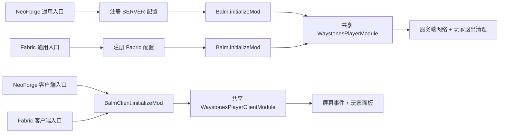

# 项目架构

本文记录 Waystones Player 的稳定技术边界、分支职责和验证门禁，供后续加载器与 Minecraft 版本移植使用。玩家安装和玩法说明以根目录 README 为准，具体上游版本与升级步骤见 [COMPATIBILITY.md](COMPATIBILITY.md)。

## 仓库与分支边界

`发行版` 是唯一正式 Git 仓库。默认分支不会随移植试验改变含义：

| 分支 | 定位 | 模块 |
|---|---|---|
| `main` | 原设计、默认发布与长期回归基线 | `common + neoforge`，Minecraft 1.21.1 |
| `fabric/1.21.1` | 同一 Minecraft 版本的多加载器移植验证 | `common + neoforge + fabric`，同时构建两端作对照 |
| `neoforge/1.21.11` | 新 Minecraft 版本移植验证 | `common + neoforge`，Minecraft 1.21.11 |

Forge 不在计划内。移植分支可以因上游 API 差异调整兼容实现，但玩家传送语义、协议方向、配置键和失败关闭策略应与 `main` 保持一致。

## 模块职责

```text
waystonesplayer
├── common       共享业务、协议、兼容边界、客户端控件、资源与测试
├── neoforge     NeoForge 入口、SERVER 配置、元数据与发行 JAR
└── fabric       仅存在于 Fabric 移植分支：Fabric 入口、配置桥接、元数据与发行 JAR
```

### `common`

- 只依赖 Minecraft/映射、`balm-common` 和 `waystones-common`。
- 禁止导入 `net.neoforged.*` 或 `net.fabricmc.*`；根工程的 `verifyCommonLoaderBoundary` 会在每次 `check` 自动阻止越界。
- 定义网络载荷、服务端验证、传送事务、Waystones 兼容层、客户端控件、语言和共享图标。
- 独立编译并运行单元测试，但不生成可安装模组。
- 通过 `commonJava`、`commonResources` 两个只读 Gradle 变体交给加载器模块；不得复制业务源码。

### `neoforge`

- 提供通用和物理客户端两个 `@Mod` 入口。
- 注册 NeoForge `ModConfig.Type.SERVER`，保留全局默认、按世界 `serverconfig` 覆盖和重载语义。
- 合并 common Java/资源并生成最终 JAR；`verifyReleaseJarContents` 检查元数据、图标、许可证、第三方声明及未打包 Waystones/Balm 类。
- 只保留入口、配置、元数据和无法跨加载器的桥接，不承载传送业务。

### `fabric`

- 只在 `fabric/1.21.1` 分支存在，提供 Fabric 通用/客户端入口和 `fabric.mod.json`。
- 通过 Balm Fabric 初始化同一组共享模块，并把 Fabric 配置值以相同的 `Supplier<PlayerTeleportExperienceMode>` 契约注入 common。
- Fabric 端配置位于实例 `config` 目录；它保持键名、默认值和运行时读取语义，但 Fabric 没有 NeoForge SERVER 的按世界覆盖机制。这个差异必须在分支 README 和配置注释中明示。
- Fabric 分支保留 NeoForge 模块并同时构建，借此发现 common 被某一加载器 API 污染的问题。

根工程只统一版本、仓库、Java 21、UTF-8、测试与架构门禁。依赖解析优先使用官方仓库，腾讯 Maven 仅为最后的后备源。

## 初始化、物理端与配置注入



common 只接收配置供应器，不知道配置文件或加载器。客户端类只能从物理客户端入口触达；服务端公共入口不得直接链接 Minecraft 客户端或 Waystones GUI 类。共享客户端入口先按类名筛选界面，再延迟加载注入器，以便不兼容的 GUI 变化安全降级。

## 网络与服务端信任边界

- 协议版本固定为 `1`，唯一服务端载荷只包含目标玩家 UUID，方向固定为 client → server。
- Balm 的服务端包处理器在主线程执行；世界、实体、菜单、物品和费用只在主线程读取或修改。
- 客户端在线列表只是展示快照，不是可信状态。服务端重新检查目标在线、不是自身、当前菜单、菜单保存的原始传送石，以及该对象仍在主手或副手。
- 每名玩家使用 10 tick 请求窗口限流；重复请求最多提示一次，退出时清理状态。
- 失败响应只显示消息，不主动关闭界面，不改变位置、经验或耐久。

任何新增字段都必须同时固定编解码、方向、协议兼容策略和服务端验证；不能让客户端提交费用、坐标或“已经验证”的状态。

## 传送事务与费用

服务端按固定顺序处理玩家目的地：

1. 执行每玩家限流。
2. 验证传送石菜单与同一个主手/副手 `ItemStack`。
3. 验证目标仍在线且不是发送者。
4. 按配置解析 Waystones 当前经验点数/等级要求。
5. 检查并先扣经验，再调用返回成功状态的服务端传送方法。
6. 传送失败或抛出运行时异常时回滚经验。
7. 仅在成功后重置坠落距离、对原传送石执行一次 `hurtAndBreak(1, ...)`，最后关闭容器。

`TeleportTransaction` 隔离检查、消费和回滚。`TeleportCost.exemptWhen` 在三条费用路径上统一处理创造模式，确保创造玩家不会只绕过 affordability 检查却仍在 `consume` 中被扣经验。原生耐久结算继续负责创造模式、耐久附魔和物品损坏。

玩家目的地只选择经验点数和经验等级要求；Waystones 冷却、物品费用和其他目的地限制不会被隐式继承。

## Waystones 兼容边界与关闭策略

对主模组内部实现的依赖只允许出现在 `compat` 包和客户端注入类：

- 菜单边界先核对注册表 ID，再反射读取 `getWarpItem`。
- 经验边界延迟加载 evaluator；结构不兼容时只告警一次，并拒绝需要计算经验的请求。
- evaluator 创建瞬态玩家目的地上下文，解析当前 Waystones 规则，只应用 Waystones 自己的经验点数/等级函数。
- 客户端布局只从已确认的 Waystones 控件/几何信息推导；找不到预期结构时不注入玩家面板。
- `NEVER` 不进入经验 evaluator，所以经验结构变化时仍可保持无经验模式；菜单本身不可识别时则整体禁用玩家目的地。

兼容失败不得返回零费用来伪装成功，也不得放宽菜单或物品校验。Minecraft/Waystones API 在 1.21.11 分支发生的包名、标识符和 GUI 变化应在该分支的兼容边界吸收，不能用重复业务实现绕过。

## 客户端布局与可访问性

1.21.1 宽屏在 Waystones 主界面左侧放置 164 像素玩家面板；空间不足时显示 20 像素头像按钮，在原界面范围内打开覆盖层。按钮先按可用宽度截断玩家名，再按实际渲染宽度居中，避免长名称越界。

| 项目 | 像素 |
|---|---:|
| 面板/列表宽度 | 164 |
| 行宽 | 132 |
| 玩家按钮宽度 | 128 |
| 左侧滚动条宽度 | 6 |
| 滚动条右缘到按钮左缘 | 12 |

玩家按钮提供完整名称 tooltip 和默认按钮叙述；窄屏切换按钮会叙述“显示/隐藏在线玩家”；面板标题可通过键盘聚焦，空列表会同时叙述空状态。客户端发送请求后不关闭界面，只有服务端确认成功才关闭容器。

在线玩家列表是界面初始化时的快照。目标离线等变化由服务端再次验证；未来若加入实时刷新，应复用现有网络状态并保持选择、滚动和焦点稳定，而不是信任客户端缓存。

## 多版本维护原则

- `main` 始终是 NeoForge 1.21.1 原设计基线；不能把默认分支直接改成 Fabric 或 1.21.11。
- 同 Minecraft 版本的加载器实现共享 common；不同 Minecraft 版本使用独立移植分支，不在一个分支堆叠多套 Minecraft 源码集。
- 行为修复先落 `main`，再按适用性移植；版本专属 API 调整留在相应分支。
- 开发/当前依赖版本与元数据最低范围分开维护。升级编译依赖不应意外抬高声明的最低兼容版本。
- 依赖范围限制在对应 Minecraft 系列，不用无上界范围把未经验证的新内部结构声明为兼容。
- 协议变化或破坏性配置变化必须显式评估迁移影响，不能只靠分支名掩盖不兼容；模组版本仍只在用户明确确认后修改。

## 验证门禁

- 共享代码：`:common:compileJava`、单元测试、`verifyCommonLoaderBoundary`。
- 网络/兼容：最低与当前 NeoForge、Waystones、Balm 成套依赖执行 `clean test build`。
- GUI：宽屏、窄屏、空列表、长名称、可滚动列表和键盘/叙述路径冒烟。
- 配置/物理端：客户端与专用服务器分别启动；NeoForge 核对世界级 SERVER 配置，Fabric 核对全局配置生成和默认值。
- 发布：检查最终 JAR 文件名、图标、元数据、入口、语言、许可证、第三方声明、敏感信息、绝对路径、大文件和未捆绑上游依赖。
- 分支：推送后确认本地 HEAD、对应远端分支和 GitHub Actions 一致。

仅编译通过不等于客户端或专用服务器已冒烟；无法执行的项目必须在交付时明确列出。
