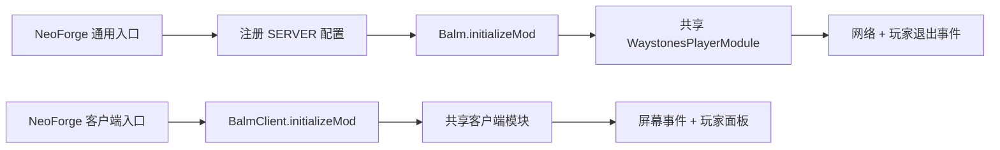

# 项目架构

本文记录 Waystones Player 的稳定技术边界，供后续 Minecraft 版本、Waystones 更新和 Fabric 接入时按需查阅。玩家安装与玩法说明以根目录 README 为准。

## 模块职责

```text
waystonesplayer
├── common     共享业务、协议、兼容层、客户端控件、资源与测试
└── neoforge   NeoForge 入口、SERVER 配置、元数据与最终发行 JAR
```

### `common`

- 只依赖 Minecraft/NeoForm、`balm-common` 和 `waystones-common`。
- 不允许导入 `net.neoforged.*` 或 `net.fabricmc.*`。
- 定义网络载荷、服务端验证与传送事务、经验兼容层、屏幕注入和双语资源。
- 独立编译并运行单元测试，但不生成可安装模组。
- 通过 `commonJava`、`commonResources` 两个只读 Gradle 变体把源码和资源交给加载器模块。

### `neoforge`

- 提供通用与客户端两个 `@Mod` 入口，并分别启动 Balm 模块。
- 拥有 NeoForge `ModConfigSpec`、SERVER 配置注册和 `neoforge.mods.toml`。
- 编译 common 源码、合并 common 资源，生成唯一面向玩家的 NeoForge JAR。
- 不复制业务逻辑；未来 Fabric 模块应采用相同原则。

根工程只统一版本、仓库、Java 21、UTF-8 和测试约定。依赖解析优先使用官方仓库，腾讯 Maven 仅为最后的后备源。

## 初始化流程



通用模块接收 `Supplier<PlayerTeleportExperienceMode>`。只有 NeoForge 模块知道配置系统；common 在服务端处理请求时读取 Supplier，从而保留配置实时值而不依赖加载器 API。

## 网络与服务端信任边界

- 协议版本固定为 `1`，服务端载荷只包含目标玩家 UUID。
- Balm 在 NeoForge 上使用主线程载荷处理器；服务端世界、实体、物品和容器状态只在主线程读取或修改。
- 客户端展示的在线列表不是可信输入。服务端会重新检查目标在线、自身目标、当前容器和原始传送石对象。
- 每名玩家使用 10 tick 请求窗口限流；重复请求最多提示一次，玩家退出时清理状态。
- 失败响应只显示消息，不关闭界面，不改变位置、经验或耐久。

## 传送事务

服务端按固定顺序处理玩家目的地：

1. 执行每玩家限流。
2. 确认当前菜单是 Waystones 传送石菜单，并确认菜单记录的同一个 `ItemStack` 仍在主手或副手。
3. 确认目标仍在线且不是发送者。
4. 按配置解析经验要求；只保留经验点数和经验等级要求。
5. 检查并先扣经验，再调用返回成功状态的服务端传送方法。
6. 传送失败或抛出运行时异常时回滚经验。
7. 仅在成功后重置坠落距离、对原传送石执行一次 `hurtAndBreak(1, ...)`，最后关闭容器。

耐久结算沿用原生行为，包括创造模式、耐久附魔和最终损坏。经验消费与传送由 `TeleportTransaction` 隔离，以确保失败路径可回滚且不会重复结算。

## Waystones 兼容边界

对主模组内部实现的依赖集中在 `compat` 包与客户端注入类：

- 菜单兼容层先核对注册表中的菜单 ID，再反射读取 `getWarpItem`。
- 经验兼容层反射加载独立 evaluator；结构不兼容时只记录一次告警，并拒绝需要计算经验的请求。
- evaluator 创建瞬态玩家目的地上下文，解析 Waystones 当前规则，只应用经验点数/等级函数。
- 客户端入口先按类名识别 Waystones 选择界面，再反射加载注入器，避免服务端或不兼容客户端提前链接 Waystones GUI 类。
- 布局从 Waystones 的 `AbstractWaystoneList` 控件推导，不使用 NeoForge 才有的容器 getter。

`NEVER` 不需要进入经验 evaluator，因此经验结构变化时仍能保持无经验模式可用。菜单结构本身不可识别时，玩家目的地整体禁用。

## 客户端布局

宽屏在 Waystones 主界面左侧放置玩家面板；空间不足时显示 20 像素头像按钮，并在原界面范围内切换覆盖层。两种模式共享同一组几何常量：

| 项目 | 像素 |
|---|---:|
| 面板/列表宽度 | 164 |
| 行宽 | 132 |
| 玩家按钮宽度 | 128 |
| 左侧滚动条宽度 | 6 |
| 滚动条右缘到按钮左缘 | 12 |

客户端发送请求后不会主动关闭界面；只有服务端确认传送成功才关闭容器。

## 配置所有权

当前唯一公开配置是 NeoForge SERVER 枚举 `playerTeleportExperienceMode`：

- `NEVER`：默认，不评估经验。
- `FOLLOW_WAYSTONES`：服从 Waystones 的费用总开关。
- `ALWAYS`：忽略总开关，但仍使用现有经验公式。

文件名 `waystonesplayer-server.toml`、默认值和世界级 `serverconfig` 覆盖属于兼容约定。未来加载器实现必须向 common 注入同一个枚举语义，不得在共享层新增加载器配置依赖。

## 修改时的最小验证

- common 代码：独立 `:common:compileJava`、单元测试和加载器导入扫描。
- 网络/传送：最低与当前 Waystones 双版本 `clean test build`，并复核所有失败路径。
- GUI：宽屏、窄屏、空列表和可滚动列表冒烟；核对 12 像素间距。
- 配置/入口：专用服务器启动，确认配置名、默认值和客户端/服务端类加载。
- 发布：只交付 `neoforge/build/libs/waystonesplayer-neoforge-1.21.1-<版本>.jar`，并检查 JAR 内容与隐私。
